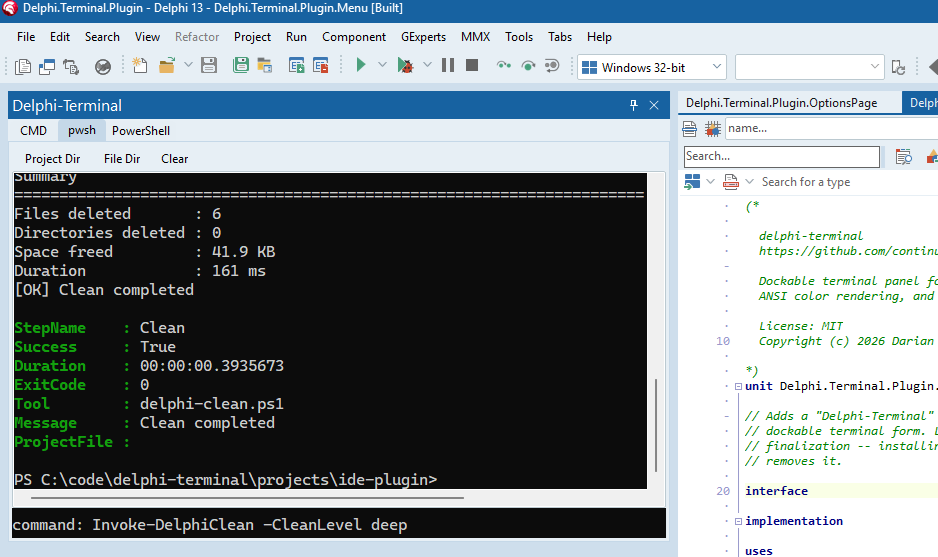
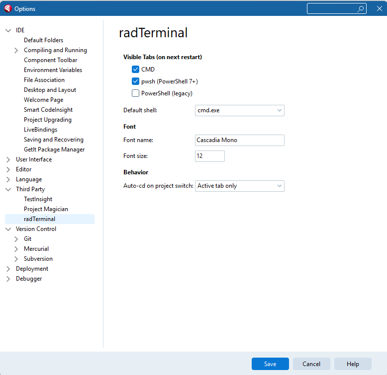
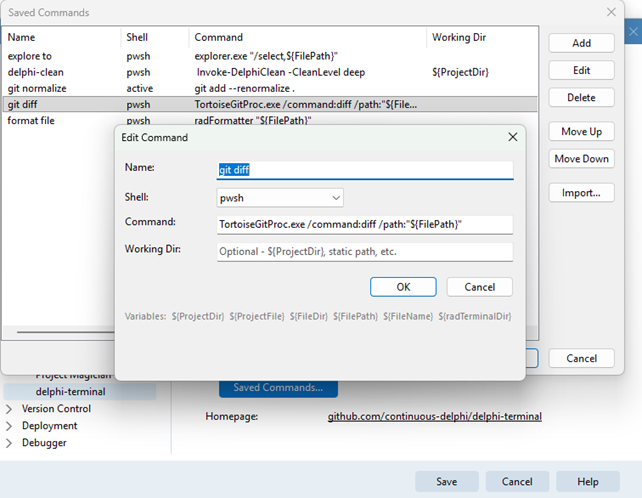

# delphi-terminal

Dockable terminal panel for **RAD Studio**. Run CMD, PowerShell 7 (pwsh),
and legacy PowerShell sessions directly inside the IDE.

## Features

- **Three shell tabs** -- CMD, pwsh, and PowerShell in a single panel
- **ANSI color rendering** -- SGR escape sequences rendered with the
  Windows Terminal Campbell palette via TRichEdit
- **Command history** -- Up/Down arrow keys recall previous commands
- **Working directory shortcuts** -- Project Dir and File Dir toolbar
  buttons resolve paths via ToolsAPI in the IDE (folder picker in
  the demo app.)
- **Process exit detection** -- shows a restart prompt when the shell
  exits: `press Enter to restart`
- **Saved commands** -- store frequently used commands and recall them
  instantly with a Ctrl+P command palette or the Commands toolbar button
  - Add, edit, delete, and reorder commands via the editor dialog
  - Each command has a name, shell type (Active / CMD / pwsh / PowerShell),
    command text, and optional working directory
  - Variable expansion: `${ProjectDir}`, `${ProjectFile}`, `${FileDir}`,
    `${FilePath}`, `${FileName}`, `${radTerminalDir}` -- resolved at
    execution time from IDE context
  - Enter previews the command in the input field for editing;
    Ctrl+Enter runs immediately (or Ctrl+DblClick)
  - Command list filtered by the active shell tab
  - [JSON bundle import](docs/command-bundles.md) for sharing command sets across machines
- **Keyboard shortcuts**
  - Ctrl+P -- open the saved-command palette
  - Ctrl+Tab / Ctrl+Shift+Tab -- cycle through shell tabs
  - Ctrl+1, Ctrl+2, Ctrl+3 -- jump to CMD, pwsh, or PowerShell tab
  - Up / Down -- navigate command history
- **IDE integration** -- dockable form with persistent dock state,
  `View` menu item, and config screen in `Tools>Options>Third Party>delphi-terminal`
- Auto change-directory option when the active Project changes
- Configurable Font Name + Font Size used in console window

## Project Layout

### Shared Frame (`source/`)

All core functionality lives in `TframeCmdShell`, a self-contained TFrame
that embeds a terminal panel with ANSI-capable TRichEdit output, command
input, and shell process management. Both the IDE plugin and the demo app
host this same frame.

### IDE Plugin (`projects/ide-plugin/`)

Minimal BPL package that registers a dockable form within RAD Studio and
hosts the shared frame. Contains mostly just IDE plumbing: menu registration
via INTAServices, ToolsAPI path resolution, and dockable form lifecycle.

### Demo VCL App (`projects/demo-vcl/`)

Standalone VCL application that hosts the shared frame in a tabbed form.
Useful for debugging the plugin.

### Tests (`test/`)

DUnitX test project covering shell process management, ANSI parsing,
and command history.

## Requirements

- A relatively recent version of RAD Studio
- You should remove {$LIBSUFFIX AUTO} for older versions.
- Plugin might otherwise be compatible back to XE3 (TStringHelper.contains)
but old versions are untested.

Optional
- Defaults to `Cascadia Mono` font (ships with Windows Terminal)
- PowerShell 7+ (`pwsh.exe`) for the pwsh tab

## Installation

### IDE Plugin

1. Open `projects/ide-plugin/Delphi.Terminal.Plugin.dpk` in RAD Studio
2. Right-click the project in Project Manager > **Install**
3. Access via **View > delphi-terminal**

## Usage

After installing, use the `View` menu and select `delphi-terminal`
Dock the form as desired and optionally save Desktop setting.

### Screenshot:

### Config screen:

### Saved commands config:

---

## Part of Continuous Delphi

This tool is part of the [Continuous-Delphi](https://github.com/continuous-delphi)
ecosystem, dedicated to the long-term success of Delphi applications.

---

 
Built with Delphi

