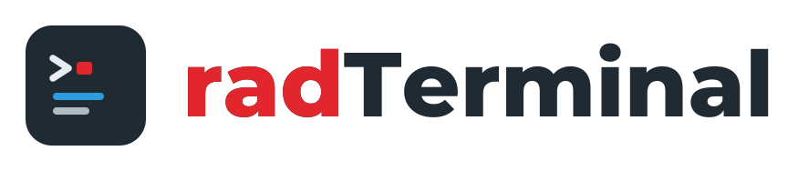

  <picture>
    <source media="(prefers-color-scheme: dark)"  srcset="assets/radterminal-logo-reversed.svg">
    <source media="(prefers-color-scheme: light)" srcset="assets/radterminal-logo.svg">
    
  </picture>

Dockable terminal panel for **RAD Studio**. Run CMD, PowerShell 7 (pwsh),
and legacy PowerShell sessions directly inside the IDE.

## Features

- **Three shell tabs** -- CMD, pwsh, and PowerShell in a single panel
- **ANSI color rendering** -- SGR escape sequences rendered with the
  Windows Terminal Campbell palette via TRichEdit
- **Command history** -- Up/Down arrow keys recall previous commands
- **Working directory shortcuts** -- Project Dir and File Dir toolbar
  buttons resolve paths via ToolsAPI in the IDE (folder picker in
  the demo app.)
- **Process exit detection** -- shows a restart prompt when the shell
  exits: `press Enter to restart`
- **Keyboard shortcuts**
  - Ctrl+Tab / Ctrl+Shift+Tab -- cycle through shell tabs
  - Ctrl+1, Ctrl+2, Ctrl+3 -- jump to CMD, pwsh, or PowerShell tab
  - Up / Down -- navigate command history
- **IDE integration** -- dockable form with persistent dock state and
  `View` menu item

## Project Layout

### Shared Frame (`source/`)

All core functionality lives in `TframeCmdShell`, a self-contained TFrame
that embeds a terminal panel with ANSI-capable TRichEdit output, command
input, and shell process management. Both the IDE plugin and the demo app
host this same frame.

### IDE Plugin (`projects/ide-plugin/`)

Minimal BPL package that registers a dockable form within RAD Studio and
hosts the shared frame. Contains mostly just IDE plumbing: menu registration
via INTAServices, ToolsAPI path resolution, and dockable form lifecycle.

### Demo VCL App (`projects/demo-vcl/`)

Standalone VCL application that hosts the shared frame in a tabbed form.
Useful for debugging the plugin.

### Tests (`test/`)

DUnitX test project covering shell process management, ANSI parsing,
and command history.

## Requirements

- A recent version of RAD Studio
- Cascadia Mono font (ships with Windows Terminal)
- PowerShell 7+ (`pwsh.exe`) for the pwsh tab (optional)

## Installation

### IDE Plugin

1. Open `projects/ide-plugin/radTerminalPlugin.dpr` in RAD Studio
2. Right-click the project in Project Manager > **Install**
3. Access via **View > radTerminal**